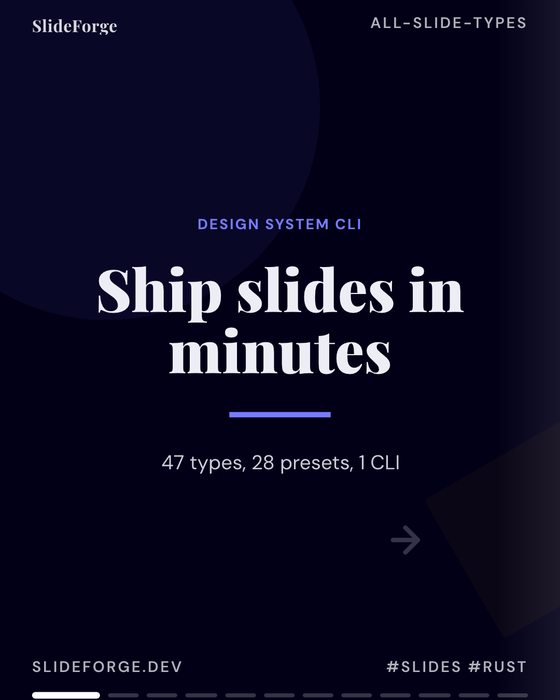
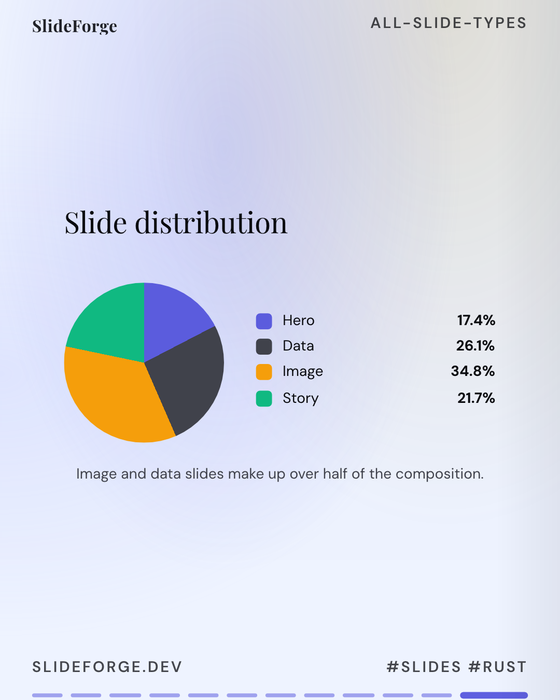
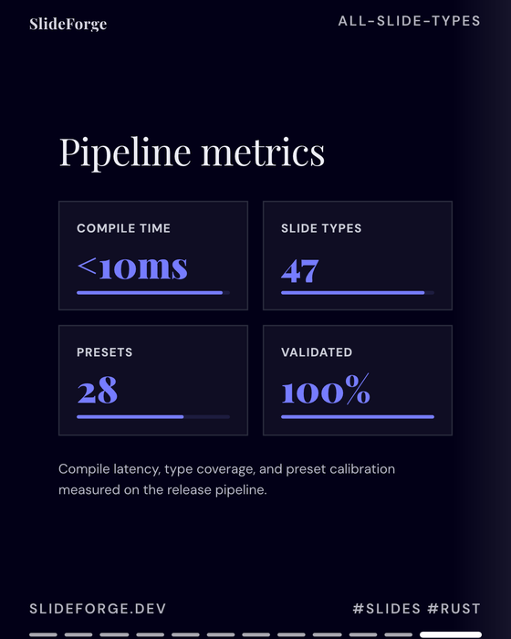
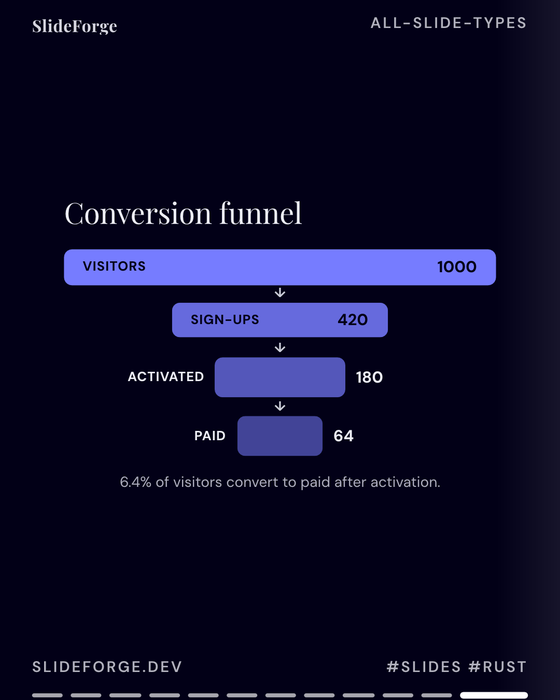
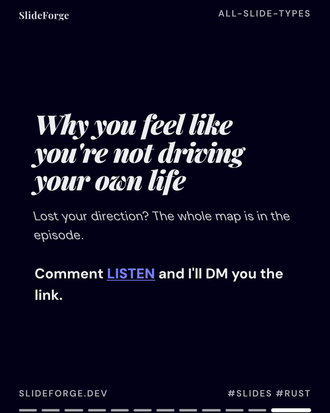

<div align="center">

<!-- T2I HERO SPEC — Subject: a slide forge — HTML slide components (typography blocks, charts, image cards, quote panels, OKLCH color swatches) being stamped into a carousel of PNG slides, fanning into Instagram/LinkedIn/TikTok phone frames; a WCAG-AA accessibility ring around the stack. Composition: left-to-right stamping line, phone frames on the right. Palette: forge ember #f97316 → deep slate #0f172a → brand gradient accents → WCAG green #34d399. Style: dark industrial flat vector, glowing stamps, no text. 16:9. -->

# Deckmill Rust

**High-performance slide carousel generator** — CLI + MCP server for creating professional Instagram/LinkedIn/TikTok carousels as HTML → PNG.

[](https://www.rust-lang.org)


[](https://github.com/ishan-parihar/deckmill/actions/workflows/ci.yml)
[](LICENSE)
[](https://modelcontextprotocol.io)
[](https://github.com/ishan-parihar/deckmill)
[](https://github.com/ishan-parihar/deckmill/releases)

</div>

---

## Features

- **46 slide types** across 6 categories: Text & Layout, Data Viz, Metrics, Story, Image, Conversion
- **MCP server** — integrate with Claude, Cursor, or any MCP client for AI-driven slide generation
- **CLI** — scriptable, CI-friendly commands for batch generation
- **Design system** — tokens, themes, archetypes, Google Fonts, CSS variables
- **Export pipeline** — HTML → PNG via the embedded Blitz renderer (stylo + vello-cpu, no browser needed; 1080×1350, 1080×1080, 1080×1920, 1200×628, etc.)
- **Validation** — pre-flight param checks, layout overflow detection, contrast auditing
- **Session persistence** — `configure_design` tokens survive MCP restarts (`~/.deckmill/session_state.json`)

---

## How it compares

| Capability | **Deckmill Rust** | Canva / Figma | Python-pptx / PPTX libs | Headless Chrome screenshot scripts |
|---|---|---|---|---|
| **Agent-native generation** | ✅ MCP server + CLI, AI-driven | ❌ GUI | ⚠️ scripted | ⚠️ |
| **Render without a browser** | ✅ embedded Blitz (stylo + vello-cpu) | n/a | n/a | ❌ needs Chrome |
| **Validation** | ✅ overflow detection + contrast (WCAG-AA) auditing | ⚠️ manual | ❌ | ❌ |
| **Slide-type library** | ✅ 46 types / 6 categories, design tokens + themes | ✅ templates | ⚠️ | ⚠️ |
| **Deterministic output** | ✅ same HTML → same PNG | ⚠️ | ✅ | ⚠️ |
| **Session design memory** | ✅ tokens persist across restarts | ✅ | ❌ | ❌ |
| **Self-hosted binary** | ✅ single Rust binary, 185 tests | ❌ SaaS | ✅ | ✅ |

Canva is a design *studio for humans*; Deckmill is a **deterministic slide factory for agents** — the same tokens, themes, and validation every run.

---

## Showcase

Every slide below is a **real export** rendered by the embedded Blitz engine (stylo layout + vello-cpu raster) — no browser, no screenshots, no doctored images.

<table>
  <tr>
    <td align="center"><br/><b>hero</b> — dark editorial, gradient accent</td>
    <td align="center"><br/><b>chart</b> — donut with legend</td>
    <td align="center"><br/><b>metric_grid</b> — KPI cards</td>
  </tr>
  <tr>
    <td align="center"><br/><b>funnel_chart</b> — conversion funnel</td>
    <td align="center"><br/><b>image_headline</b> — full-bleed photo</td>
    <td align="center"><br/><b>comment_cta</b> — conversion close</td>
  </tr>
</table>

Browse the full interactive decks: [`all_types_carousel.html`](dist/all_types_carousel.html) · [`typology_viewer.html`](dist/typology_viewer.html) · [`random_styles_viewer.html`](dist/random_styles_viewer.html) · [`stress_test_master.html`](dist/stress_test_master.html)

---

## Quick Start

### Install (pre-built binary)

```bash
# Static musl binary (runs on any Linux, no dependencies) — grab from Releases:
curl -fsSL https://github.com/ishan-parihar/deckmill/releases/download/v0.4.0/deckmill-x86_64-unknown-linux-musl \
  -o ~/.local/bin/deckmill && chmod +x ~/.local/bin/deckmill

# Or build from source:
cargo install --git https://github.com/ishan-parihar/deckmill
```

### CLI Usage

```bash
# Generate a single slide
deckmill generate-slide hero \
  --primary-color '#4F46E5' \
  --params '{"headline":"Ship slides in minutes","subheadline":"AI-powered carousels"}' \
  --override accent='#00FF88'

# Export carousel to PNGs
deckmill export ./carousel.html \
  --output-dir ./exports \
  --slides 4 \
  --preset instagram_portrait

# List all slide types
deckmill list-slides

# Get schema for a slide type
deckmill slide-info hero
```

### MCP Server

```bash
# Start MCP server (stdio transport)
deckmill mcp
```

Configure in your MCP client (Claude Desktop, Cursor, etc.):

```json
{
  "mcpServers": {
    "deckmill": {
      "command": "deckmill",
      "args": ["mcp"]
    }
  }
}
```

**MCP Tools:**
- `configure_design` — set brand color, theme, archetype, platform (persists to disk)
- `generate_slide` — create one slide (validates required params, blocks on missing)
- `render_carousel` — assemble slides into full HTML carousel
- `export_carousel_slides` — render carousel to PNG directory
- `preview_slide` — quick single-slide PNG preview
- `get_slide_type_info` — discover required/optional params + example payload
- `validate_layout` / `validate_design` — audit HTML for overflow, contrast, clipping

---

## Slide Types (46 total)

| Category | Types |
|----------|-------|
| **Text & Layout** | hero, feature, list, quote, cta, comparison, stat_row, timeline, callout, split_features, grid_cards, definition, text_block, section_divider, text_columns |
| **Data Visualization** | chart, scatter_plot, gauge, radar_chart, column_chart, table, metric_sparkline, funnel_chart, metric_grid, comparison_bars, progress_rings |
| **Story** | problem_solution, myth_fact, case_study_result, testimonial_avatar, before_after_story, logo_cloud, pricing_plan, checklist_action_plan, faq, process_map |
| **Image** | image_caption, image_headline, image_quote, image_callout, image_stat, image_gallery, image_collage, image_comparison |
| **Conversion** | qr_destination |

Each type exposes `required_params`, `optional_params`, `variants`, and an `example` payload via `get_slide_type_info`.

---

## Configuration

### Design Tokens (via `configure_design`)

```json
{
  "primary_color": "#4F46E5",
  "visual_theme": "bold",        // editorial, bold, minimal, dark, vibrant, natural
  "preset": "vibrant",           // tonal_spot, vibrant, neutral, monochrome, expressive, fidelity, rainbow, fruit_salad, content
  "archetype": "startup_pitch",  // educator, thought_leader, startup_pitch, brand_storyteller, data_analyst, creator
  "platform": "instagram_portrait",
  "brand_name": "Acme Inc",
  "brand_handle": "@acme"
}
```

Tokens persist to `~/.deckmill/session_state.json` and survive MCP restarts.

### Token Override (CLI only)

```bash
deckmill generate-slide hero \
  --primary-color '#FF5500' \
  --params '{"headline":"Override test"}' \
  --override accent='#00FF88' \
  --override secondary='#222244'
```

Unknown keys warn with typo suggestions (`typo` → `Did you mean 'accent'?`).

---

## Export Pipeline

```
generate-slide(s) → render-carousel → export
```

| Preset | Aspect | Dimensions | Use Case |
|--------|--------|------------|----------|
| `instagram_portrait` | 4:5 | 1080×1350 | Feed carousels |
| `instagram_square` | 1:1 | 1080×1080 | Feed posts |
| `instagram_story` | 9:16 | 1080×1920 | Stories/Reels |
| `tiktok_vertical` | 9:16 | 1080×1920 | TikTok |
| `linkedin_landscape` | 1.91:1 | 1200×628 | LinkedIn docs |
| `twitter_card` | 16:9 | 1200×675 | Twitter/X |
| `presentation_16_9` | 16:9 | 1920×1080 | Slides |
| `presentation_4_3` | 4:3 | 1024×768 | Slides |

**PNG geometry fix (v0.2.0+):** All presets now render at exact target dimensions (no more 143px height deficit).

---

## Validation

```bash
# Validate slide params before rendering
deckmill validate-layout --slide-type hero --params '{"headline":"Test"}'

# Audit rendered HTML for design issues
deckmill validate-design ./carousel.html
```

Checks: overflow, contrast, descender clipping, squished components, distorted images, progress ring thickness, text column width.

---

## Memory Profile

The Blitz rendering engine (stylo layout + vello-cpu raster) is embedded in the binary — no Chromium subprocess, no browser download, no persistent browser pool. Measured against the legacy headless-Chrome build on the same 8-slide export workload:

| Metric | Blitz (v0.4.0) | Legacy Chrome | Delta |
|--------|----------------|---------------|-------|
| Peak RSS | **132 MB** | 599 MB | **4.5× less** |
| Wall time | 13.3 s | 15.4 s | 1.2× faster |

| Component | RSS (idle) |
|-----------|------------|
| MCP server | **~8.5 MB** |
| CLI (generate-slide) | **~4 MB** |

---

## Build from Source

```bash
# Standard (glibc)
cargo build --release

# Musl static (for Alpine/scratch containers)
cargo build --release --target x86_64-unknown-linux-musl
```

Requires: Rust 1.75+, `clang`/`lld` for the musl target (aws-lc-sys).

The build uses **rustls-only TLS** — a vendored `blitz-net` ([`[patch.crates-io]`](./Cargo.toml)) swaps its hardcoded `native-tls` for `rustls` so no `libssl`/`libcrypto` is ever linked. The musl artifact is a fully static ~21 MB binary (verified `statically linked` via `ldd`).

---

## License

MIT — see [LICENSE](LICENSE).
---

## Agent Integration (AXI §7)

Deckmill ships an installable AI agent skill that provides ambient context at session start — showing slide types, design tokens, and contextual help hints.

### Install the Skill

```bash
# Via npx (recommended)
npx skills add ishan-parihar/deckmill --skill deckmill

# Or download manually
curl -fsSL https://raw.githubusercontent.com/ishan-parihar/deckmill/master/SKILL.md \
  -o ~/.agents/skills/deckmill/SKILL.md
```

### Session Hook (Claude Code)

Add to `~/.claude/settings.json` or project `.claude/settings.json`:

```json
{
  "hooks": {
    "SessionStart": [
      {
        "matcher": "",
        "hooks": [
          {
            "type": "command",
            "command": "deckmill"
          }
        ]
      }
    ]
  }
}
```

At session start, Deckmill prints a compact dashboard:

```
bin: ~/.local/bin/deckmill
description: Instagram/LinkedIn/TikTok carousel generator — 46 slide types, 8 platform presets

slides[46]{type,description}:
  hero,Opening hook with headline and subheadline
  ...

design_tokens:
  primary_color: #4F46E5
  theme: bold
  archetype: startup_pitch

help[4]:
  Run `deckmill list-slides` to see all 46 slide types
  Run `deckmill generate-slide hero --params '{...}'` to create a slide
  Run `deckmill render-carousel slides.json --tokens-file tokens.json` to render
  Run `deckmill export carousel.html --output-dir ./exports` to export PNGs
```

### Session Hook (Codex)

Add to `~/.codex/hooks.json` or project `.codex/hooks.json`:

```json
{
  "SessionStart": "deckmill"
}
```

### Session Hook (OpenCode)

Create `~/.config/opencode/plugins/deckmill.ts`:

```typescript
export default {
  name: "deckmill",
  onSessionStart: async () => {
    const { execSync } = require("child_process");
    return execSync("deckmill").toString();
  },
};
```

---

## ☕ Support & Sponsorship

If you find this project useful, consider supporting ongoing development:

[](https://github.com/sponsors/ishan-parihar)
[](https://rzp.io/rzp/ishan-parihar)

Your support funds new features, releases, and infrastructure for the whole ecosystem.